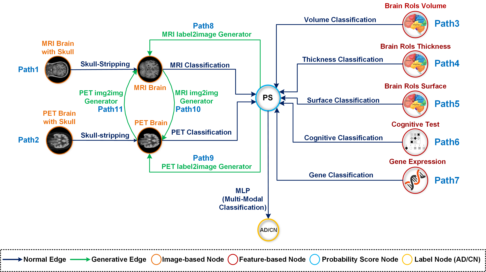

# MADD

This repo contains the code for creating a graph of a Modular Alzheimer's Disease Detector (MADD). 

Here, we leverage different classification, segmentation, and GAN models to introduce a solution to more accurately and comprehensively detect Alzheimer disease withing different types of image modality and feature datasets

### Examples
In examples folder, you can find different examples of how to create a graph with dataset nodes and edge models and how to train, fine-tune, test, and predict. You should copy the examples code into the main.py script and run it.

### Checkpoints
The model checkpoints are uploaded to this [link](https://drive.google.com/drive/folders/13uo0lKwsCnKot8cJDOtvNBryUtDDiiw4?usp=sharing).

### Requirements

* [Optional] Create a conda or python virtual environment.

* Install required packages using the `requirements.txt` file.
```
pip install -r requirements.txt
```

### Useful Information
If you have any questions, contact us at nmashhad@ucsc.edu.

